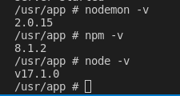

# Version



## Npm Environment Setup

```cmd=
npm install --save babel-plugin-transform-decorators-legacy babel-preset-env babel-preset-react babe
l-preset-react-app express react react-dom
```

## Reference

babel-node setting

https://babeljs.io/docs/en/babel-node

https://www.bilibili.com/video/BV1EE411e7B1?p=3